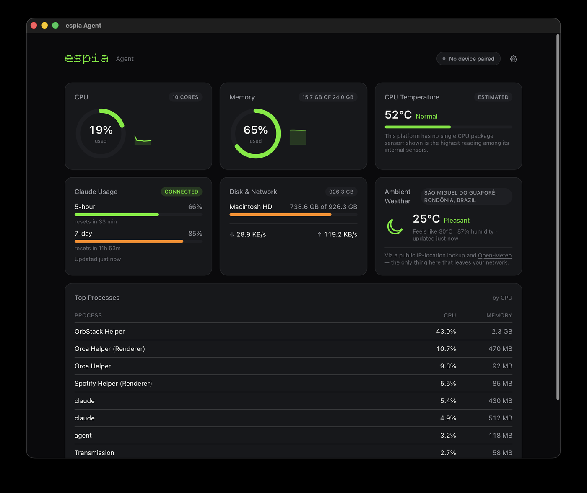

<p align="center">
  
</p>

<p align="center">
  A tiny desk display for your computer's vitals and AI usage — powered by an ESP32.
</p>

<p align="center">
  <a href="LICENSE"></a>
  <a href="docs/adr/"></a>
  <a href="CONTRIBUTING.md"></a>
  <a href="#platform-support"></a>
</p>

espia mirrors live information from your computer onto a small ESP32-driven
screen sitting on your desk — CPU, memory, GPU, network, and AI usage
(starting with Claude), rendered as clean, glanceable charts. The name is a
small pun: **ESP**, the chip family this runs on, and *espiar* — Portuguese
for "to watch" — because that's what this does, quietly, from the corner of
your desk.

> [!WARNING]
> espia is in early design. The desktop agent below is real and working;
> the ESP32 firmware and device pairing are still being built. See
> [Status](#status) for exactly what exists today.

<p align="center">
  
</p>

## Contents

- [Status](#status)
- [How it works](#how-it-works)
- [Zero-configuration networking](#zero-configuration-networking)
- [Running it on a VPS or Docker host](#running-it-on-a-vps-or-docker-host)
- [Platform support](#platform-support)
- [Features](#features)
- [Repository layout](#repository-layout)
- [Documentation](#documentation)
- [Contributing](#contributing)
- [License](#license)

## Status

| Piece                                                        | State |
| ------------------------------------------------------------- | ----- |
| Desktop agent (macOS) — metrics, Claude usage, weather, settings | **Working**, built with [Tauri](https://tauri.app/) |
| Headless agent (Linux, for a VPS or Docker host)              | **Working** — see [running it on a VPS](#running-it-on-a-vps-or-docker-host) |
| Desktop agent (Windows, Linux)                                 | Planned |
| ESP32 firmware — boot screen only                              | In progress |
| Device discovery, pairing, and live dashboards                 | Designed ([ADR 0002](docs/adr/0002-device-discovery.md), [ADR 0007](docs/adr/0007-multi-agent-pairing.md), [ADR 0015](docs/adr/0015-device-provisioning.md)), not built |

Every decision behind these pieces — and why — is written down as it's
made; see [Architecture Decision Records](docs/adr/).

## How it works

```
┌──────────────── Computer (Windows / macOS / Linux) ────────────────┐           ┌────── ESP32 + display ──────┐
│  Collectors ──► Aggregator ──► WebSocket server + mDNS announcer   │   Wi-Fi   │  Discovery (mDNS / UDP)     │
│  (CPU, RAM, GPU, network, AI providers)                            │◄─────────►│  WebSocket client           │
│  Settings UI (HTML / CSS / JS)                                     │   JSON    │  User interface             │
└────────────────────────────────────────────────────────────────────┘           └─────────────────────────────┘
```

- **Agent** — a lightweight desktop app that collects metrics and streams
  them over the local network. Also runs headless (no window), for a
  machine with no display — see below.
- **Firmware** — runs on the ESP32, finds the agent automatically, and draws
  the dashboards.
- **Protocol** — a small, versioned JSON protocol shared by both sides.

### Zero-configuration networking

- **Wi-Fi setup without a keyboard:** the device opens a captive portal you
  configure from your phone — see [ADR 0015](docs/adr/0015-device-provisioning.md)
  for the full design, including adding a remote (non-LAN) agent the same
  way.
- **No hard-coded IP addresses:** the agent announces itself via mDNS, with a
  UDP broadcast fallback. If the connection drops or an IP changes, the device
  simply discovers the agent again.
- **Pairing:** the first connection is confirmed with a short code shown on
  the device screen, so other computers on the network can't take it over. A
  device can pair with more than one agent at once — see
  [ADR 0007](docs/adr/0007-multi-agent-pairing.md).

## Running it on a VPS or Docker host

The agent also runs **headless** — no window, no display needed — as a
small, token-gated HTTP endpoint: `GET /metrics` for CPU/memory/disk/network,
and an optional `GET /containers` for per-container stats on a Docker host,
protected by a minimal proxy of its own
([`espia-socket-guard`](agent/socket-guard/README.md)) rather than handing
the agent root access to the whole Docker daemon.

```sh
cd agent
docker compose up -d --build   # ESPIA_TOKEN=... required — see the guide below
```

- [`agent/headless/README.md`](agent/headless/README.md) — endpoints,
  environment variables, security model.
- [`docs/deploy-easypanel.md`](docs/deploy-easypanel.md) — a full walkthrough
  for deploying to [Easypanel](https://easypanel.io/), written from doing it
  for real.

## Platform support

| Platform | Desktop agent           | Headless agent |
| -------- | ------------------------ | --------------- |
| macOS    | **Working** (first target) | Working (builds and runs) |
| Linux    | Planned                  | **Working** |
| Windows  | Planned                  | Not targeted |

espia supports several ESP32 boards. See the
[firmware documentation](firmware/README.md#supported-boards) for the list.

## Features

- [x] System metrics: CPU (with per-core temperature), memory, disk, network
- [x] Claude subscription plan limits (5-hour and 7-day windows), with
      reset countdowns
- [x] Ambient (outdoor) weather for your city, with a manual location
      override
- [x] A settings screen: language (English / Português / Español)
- [x] A headless HTTP agent for a VPS or Docker host, with optional
      per-container stats
- [ ] GPU metrics (NVIDIA first; AMD and Apple Silicon later)
- [ ] Claude token usage and cost
- [ ] Pluggable providers for other AI services
- [ ] ESP32 firmware: discovery, pairing, and live dashboards
- [ ] Multiple screens with touch / button navigation
- [ ] Over-the-air (OTA) firmware updates from the agent
- [ ] In-browser device simulator for UI development without hardware

## Repository layout

| Path                     | Description                                   |
| ------------------------ | --------------------------------------------- |
| [`agent/`](agent/)       | Desktop agent (Windows, macOS, Linux) and a headless variant for a VPS or Docker host |
| [`firmware/`](firmware/) | ESP32 firmware                                |
| [`protocol/`](protocol/) | Agent ↔ device protocol specification         |
| [`docs/`](docs/)         | Architecture notes and decision records (ADR) |

## Documentation

- [Architecture overview](docs/architecture.md)
- [Protocol specification](protocol/README.md)
- [Architecture Decision Records](docs/adr/) — every significant decision,
  with the reasoning and alternatives considered
- [Deploying the headless agent to Easypanel](docs/deploy-easypanel.md)

## Contributing

Contributions are welcome! Please read [CONTRIBUTING.md](CONTRIBUTING.md)
and our [Code of Conduct](CODE_OF_CONDUCT.md) before getting started.

## License

espia is released under the [MIT License](LICENSE).

espia is an independent project and is not affiliated with or endorsed by
Anthropic, Espressif, or any AI provider it integrates with.
